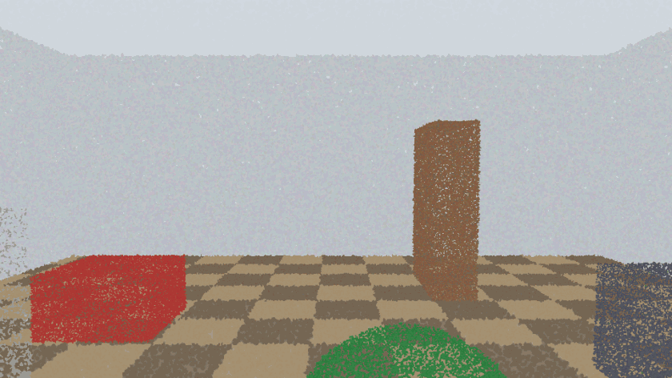
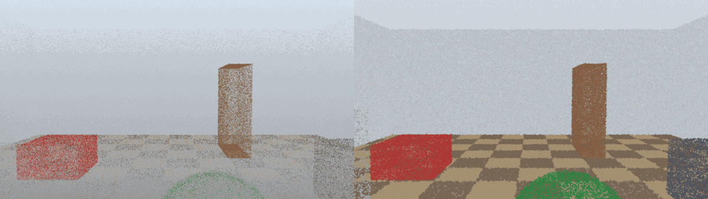
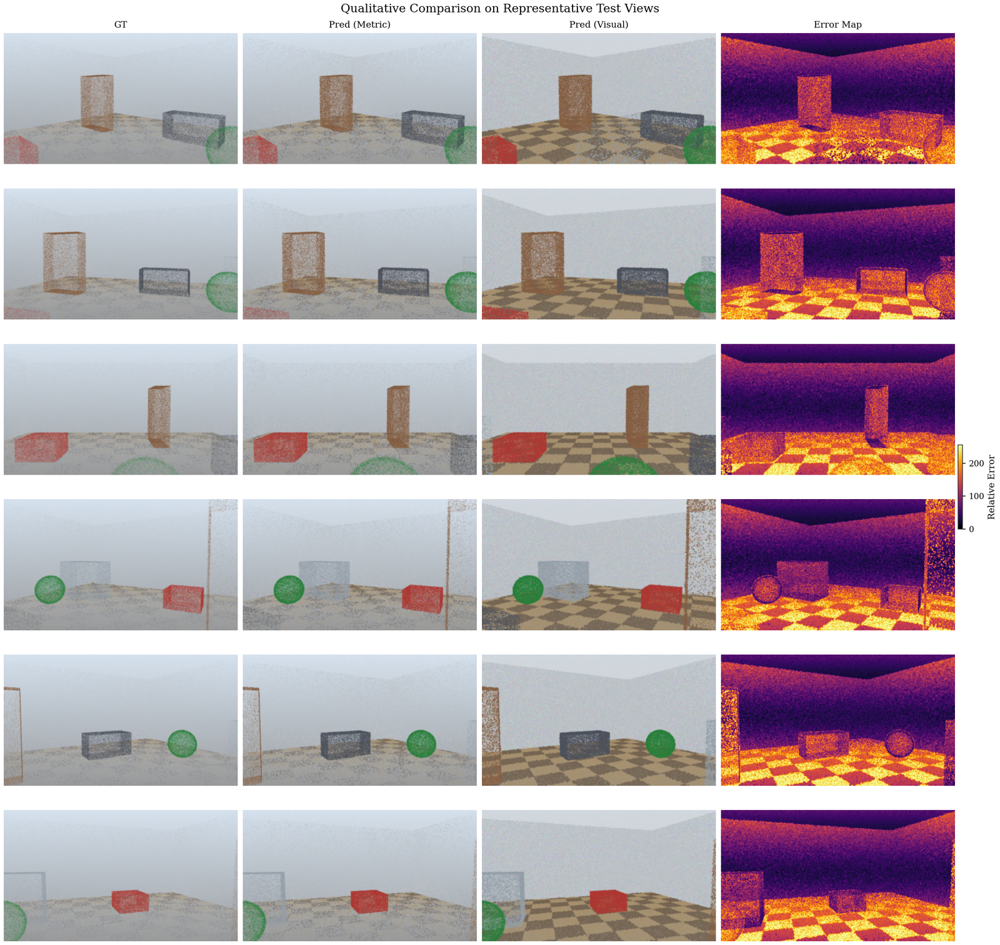
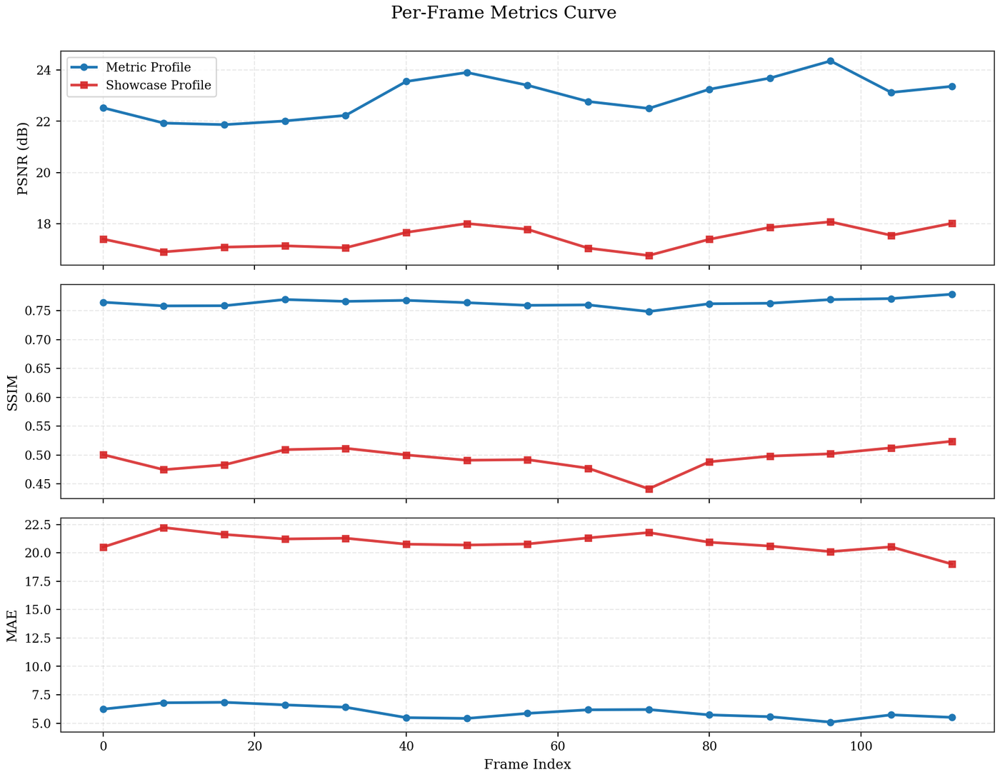
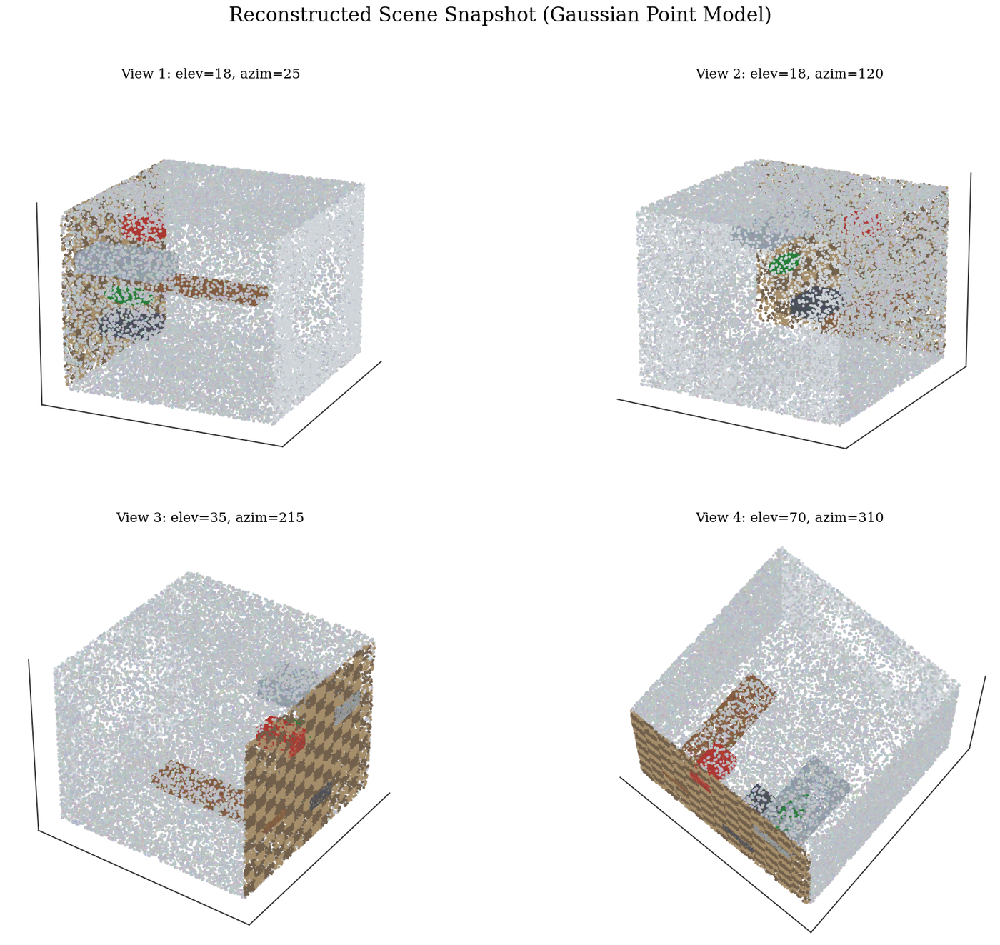

# Indoor Inspection 3D Reconstruction

End-to-end 3D reconstruction pipeline for indoor RGB-D inspection sequences. The project turns multi-view captures into a Gaussian-style scene representation, renders novel views, and reports reconstruction quality with reproducible metrics.

<p align="center">
  
</p>
<p align="center">
  Novel-view flythrough generated from the reconstructed scene.
</p>

## Why This Repo

- End-to-end workflow: dataset preparation, reconstruction, rendering, evaluation.
- Python-only baseline with deterministic outputs.
- Ready-to-share artifacts in PNG and GIF formats.
- Includes quantitative evaluation and paper-style visual assets.

## Results At A Glance

| Metric | Value |
| --- | ---: |
| Test PSNR | 22.97 dB |
| Test SSIM | 0.764 |
| Test MAE | 5.97 |
| Test Coverage | 0.319 |
| Chamfer L2 | 0.00727 |
| Raw 3D points fused | 1,340,183 |
| Final Gaussian points | 220,000 |
| Frames in inspection sequence | 120 |

Source summaries:
- `outputs_ready/metrics/summary_test_metric.json`
- `outputs_ready/model/reconstruction_summary.json`

## Visual Showcase

### Prediction vs Ground Truth

<p align="center">
  
</p>

### Qualitative Test Frames

<p align="center">
  
</p>

### Metrics And Model Snapshot

<p align="center">
  
  
</p>

The main stages are:
- Multi-view RGB-D sequence preparation.
- Gaussian-style scene reconstruction from fused depth observations.
- Nearest-view rendering for novel-view synthesis.
- Evaluation with PSNR, SSIM, MAE, coverage, and geometry summary.

## Repository Layout

```text
configs/                   run configuration files
data/                      dataset folders and metadata
recon3d/                   reconstruction, rendering, metrics utilities
scripts/                   end-to-end pipeline entrypoints
outputs/                   experiment outputs
outputs_ready/             curated figures, GIFs, metrics, and samples
docs/readme_assets/        lightweight assets used by this README
```

## Environment

- OS: Ubuntu
- Language: Python 3
- Recommended GPU: NVIDIA RTX A5000

Install dependencies:

```bash
cd /home/aimldl/project4
python3 -m pip install -r requirements.txt
```

## Quick Start

Run the full pipeline:

```bash
cd /home/aimldl/project4
python3 scripts/run_end_to_end.py \
  --dataset data/indoor_inspection_v1 \
  --output outputs/indoor_run \
  --frames 120 \
  --width 960 \
  --height 540 \
  --test-stride 8 \
  --depth-stride 3 \
  --source-stride 1 \
  --voxel-size 0.02 \
  --max-points 220000 \
  --render-mode nearest_views \
  --source-k 10 \
  --hole-blend-distance 12 \
  --blur-sigma 0.35
```

Run step-by-step if you want more control:

```bash
python3 scripts/generate_indoor_dataset.py \
  --out data/indoor_inspection_v1 \
  --frames 120 \
  --width 960 \
  --height 540 \
  --test-stride 8 \
  --seed 123 \
  --export-gif \
  --gif-name dataset_preview.gif \
  --gif-fps 12 \
  --save-reference-cloud
```

```bash
python3 scripts/reconstruct_gaussian_scene.py \
  --dataset data/indoor_inspection_v1 \
  --out outputs/indoor_run/reconstruction \
  --split all \
  --depth-stride 3 \
  --source-stride 1 \
  --voxel-size 0.02 \
  --max-points 220000
```

```bash
python3 scripts/render_gaussian_views.py \
  --dataset data/indoor_inspection_v1 \
  --model outputs/indoor_run/reconstruction/gaussians.npz \
  --split test \
  --out outputs/indoor_run/renders_test \
  --render-mode nearest_views \
  --source-k 10 \
  --hole-blend-distance 12 \
  --blur-sigma 0.35 \
  --save-gt \
  --save-comparison \
  --export-gif \
  --gif-name novel_views_test.gif \
  --gif-fps 12
```

```bash
python3 scripts/evaluate_reconstruction.py \
  --dataset data/indoor_inspection_v1 \
  --model outputs/indoor_run/reconstruction/gaussians.npz \
  --split test \
  --out outputs/indoor_run/eval_test \
  --render-mode nearest_views \
  --source-k 10 \
  --hole-blend-distance 12 \
  --blur-sigma 0.35
```

## Key Outputs

Dataset:
- `data/indoor_inspection_v1/images/*.png`
- `data/indoor_inspection_v1/depth/*.png`
- `data/indoor_inspection_v1/transforms_{train,test,all}.json`
- `data/indoor_inspection_v1/intrinsics.json`
- `data/indoor_inspection_v1/metadata.json`

Reconstruction:
- `outputs/indoor_run/reconstruction/gaussians.npz`
- `outputs/indoor_run/reconstruction/source_views.npz`
- `outputs/indoor_run/reconstruction/gaussians_preview.ply`

Rendering:
- `outputs/indoor_run/renders_test/pred/*.png`
- `outputs/indoor_run/renders_test/comparison/*.png`
- `outputs/indoor_run/renders_test/novel_views_test.gif`
- `outputs/indoor_run/renders_all/flythrough_all.gif`

Evaluation:
- `outputs/indoor_run/eval_test/metrics_per_frame.csv`
- `outputs/indoor_run/eval_test/summary.json`

Showcase package:
- `outputs_ready/visual/`
- `outputs_ready/paper/`
- `outputs_ready/samples/`

## Notes

- This repo is optimized for reproducible portfolio-ready outputs.
- Visual deliverables are intentionally limited to PNG and GIF.
- If you want to publish the repo, the curated assets under `docs/readme_assets/` are already sized for GitHub README rendering.